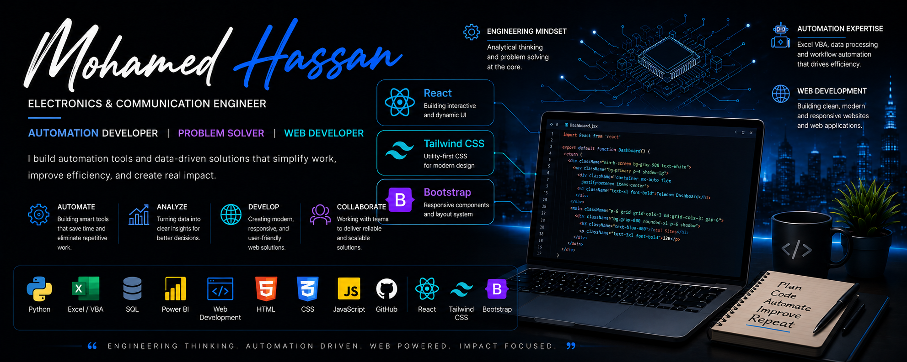

# Hi there 👋, I'm Mohamed Hassan

### Electronics & Communication Engineer  
### Automation & Software Developer

💡 Passionate about automation, workflow optimization, web development, and data-driven solutions.

🔹 Python | VBA | Web Development | Power BI | AI  
🔹 Building tools that simplify work and improve efficiency  
🔹 Open to freelance and remote opportunities

---

## 🚀 Technologies & Tools

### 🌐 Web Development

  

### 📊 Data & Automation

  
  
  
  

### 📡 Telecom & Network Operations

  
  
  
  
  
  
  

---

## 📊 Featured Skills
- Automation & Scripting
- Excel VBA Development
- Data Analysis & Visualization
- Workflow Optimization
- Web Development
- Power BI Dashboards

---

## 🌍 Connect with Me

<!--
**MohamedHassan-codeflow/MohamedHassan-codeflow** is a ✨ _special_ ✨ repository because its `README.md` (this file) appears on your GitHub profile.

Here are some ideas to get you started:

- 🔭 I’m currently working on ...
- 🌱 I’m currently learning ...
- 👯 I’m looking to collaborate on ...
- 🤔 I’m looking for help with ...
- 💬 Ask me about ...
- 📫 How to reach me: ...
- 😄 Pronouns: ...
- ⚡ Fun fact: ...
-->
